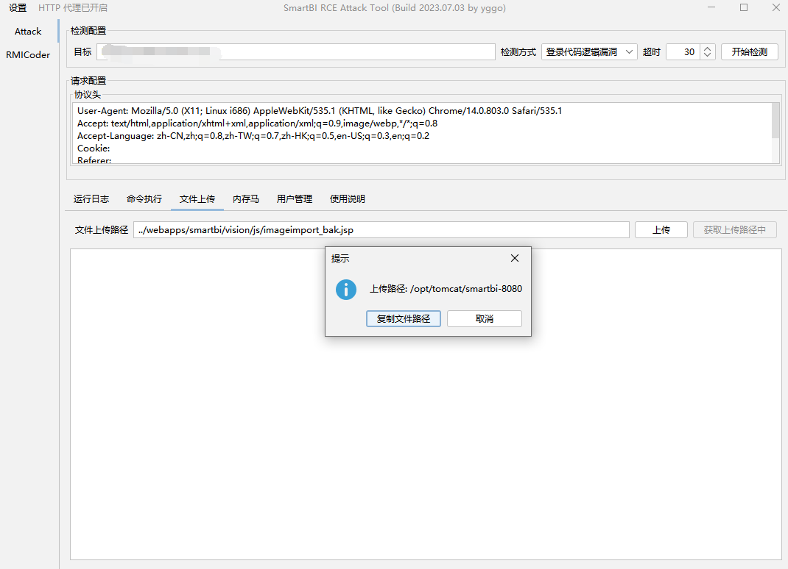
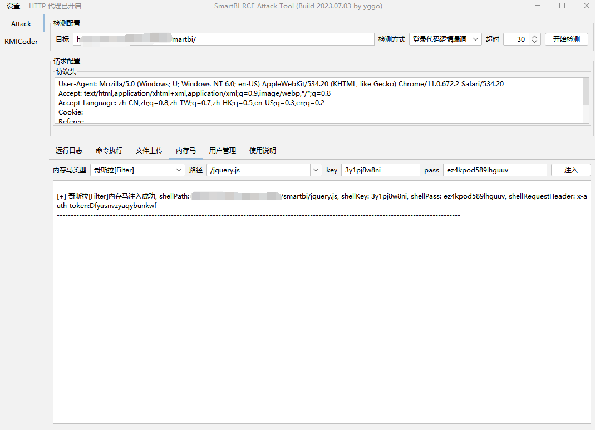

# SmartBIAttackTool

SmartBI 登录代码逻辑漏洞导致的远程代码执行利用工具，所有请求与响应均使用RMICoder进行编解码，规避常规流量设备检测。

# 支持功能

## 登录代码逻辑漏洞检测

## 命令执行

## 文件上传

## 内存马注入

## 用户管理

## RMICoder编解码

## 数据源管理

支持自动解密连接密码。

## 配置文件信息获取

主要用于获取`SmartBI`配置文件中的数据库信息，支持自动解密连接密码。

